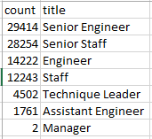
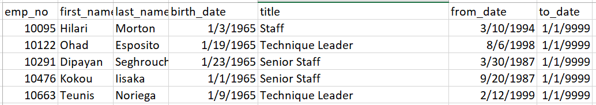
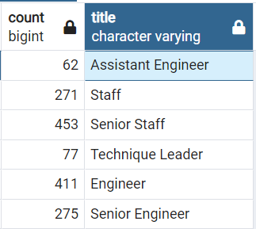

# Pewlett_Hackard_Analysis
## Overview of the analysis
I helpped Bobby to find the number of retiring employees based on their current job title and identify the specific employees who are eligible for mentorship program. 

## Results
### Retiring_titles table
- Currently, 7 job titles employees need to retire, that are Senior Engineer, Senior staff, Engineer, Staff, Technique Leader, Assistant Engineer, and Manager.
- Senior Engineer has the largest retiring population, which is 29,414 and only 2 Manager are in the retiring list.

### Mentorship_eligibility table
- Total 1549 employees are in the mentorship list. 
- Their birth year are 1965 and still working currently.
- 

## Summary
- What are the total number of retiring employees for all the job titles? 90,398
Select SUM(COUNT) from retiring_titles;
- What are the number of mentorship eligibility emaployees per each job title?
Select COUNT(emp_no), title 
from mentorship_eligibility
GROUP BY title;

